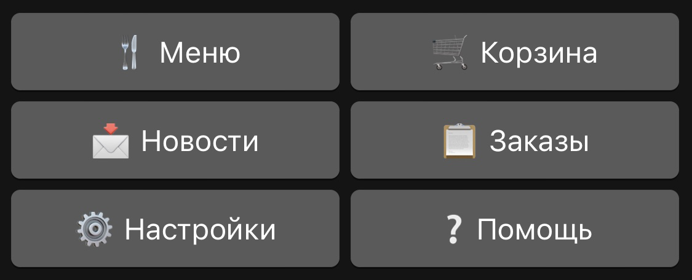

# CHAT BURGER

Чат-бот на платформе мессенджера Telegram. Простой и эффективный инструмент, который может выступать одним из способов ведения бизнеса. Он помогает повысить уровень лояльности клиентов, автоматизировать и ускорить ряд рабочих процессов компании.

#### Стек технологий

Python + Telegram Bot API + Telebot(pyTelegramBotAPI) + SQLite3 + Flask

#### Пользовательский интерфейс

Пользовательский интерфейс чат-бота реализован с помощью кнопок и клавиатур.

